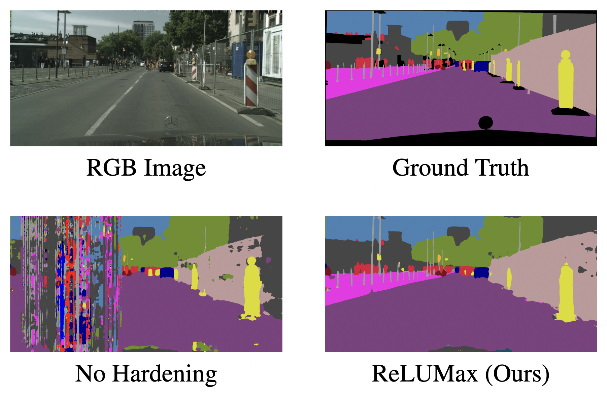

# Transient Fault Tolerant Semantic Segmentation for Autonomous Driving \[ECCV UnCV Workshop 2024\]
Official code of our work "Transient Fault Tolerant Semantic Segmentation for Autonomous Driving" accepted at the [3rd Workshop on Uncertainty Quantification for Computer Vision (UnCV)](https://uncertainty-cv.github.io/2024/) (Extended Abstract Track) at ECCV 2024.

<p align="center"></p>

# Introduction
<i>Deep learning models are crucial for autonomous vehicle perception, but their reliability is challenged by algorithmic limitations and hardware faults. We address the latter by examining fault-tolerance in semantic segmentation models. Using established hardware fault models, we evaluate existing hardening techniques both in terms of accuracy and uncertainty and introduce ReLUMax, a novel simple activation function designed to enhance resilience against transient faults. ReLUMax integrates seamlessly into existing architectures without time overhead. Our experiments demonstrate that ReLUMax effectively improves robustness, preserving performance and boosting prediction confidence, thus contributing to the development of reliable autonomous driving systems.</i>

# Getting Started

We implemented the base code starting with python 3.10 on CUDA 11.8. Once a clean virtual environment is properly setup, run from the shell
```bash
pip install -r requirements.txt
```

### Datasets
To download the Cityscapes dataset we've added a script in the `data/` folder. You can download it by running
```bash
python data/download_cityscapes.py
```

While the GTA5 dataset can be downloaded from: https://download.visinf.tu-darmstadt.de/data/from_games/ (eg. via `wget`)

### Running the Experiments
To run the experiments we've included the scripts to launch a dummy experiment in the `launch_scripts/` folder. You can start from there to launch the experiments or add your custom runs.

# Citation
```
@article{iurada2024transient,
  author={Iurada, Leonardo and Cavagnero, Niccolò and Fernandes Dos Santos, Fernando and Averta, Giuseppe and Rech, Paolo and Tommasi, Tatiana},
  journal={arXiv preprint arXiv:2408.16952}, 
  title={Transient Fault Tolerant Semantic Segmentation for Autonomous Driving},  
  year={2024}
}
```
